DOCUMENTACION DE LA API DE PELICULAS/USUARIOS

Parte 1:
Creamos un proyecto en laravel desde el cmd que se llama "LARAVEL-API", una vez que se haya creado, se visualizara la en el explorador de archivos la carpeta, pero ya con sus respectivos archivos asi como se muestra en la imagen a continuacion:

Despues abrimos el Visual Studio Code, para estar trabajando con el proyecto que creamos y algo asi se debe de mostrar
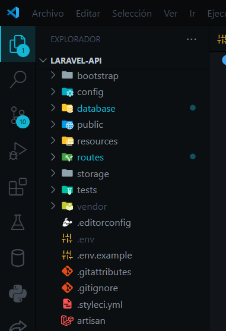
Una vez que ya esta todo listo los arhivos, ejecutamos el comando "php artisan serve", para visualizar que el servidor de laravel funciona correctamente 
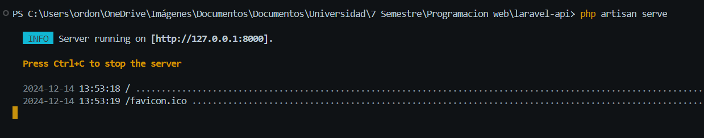
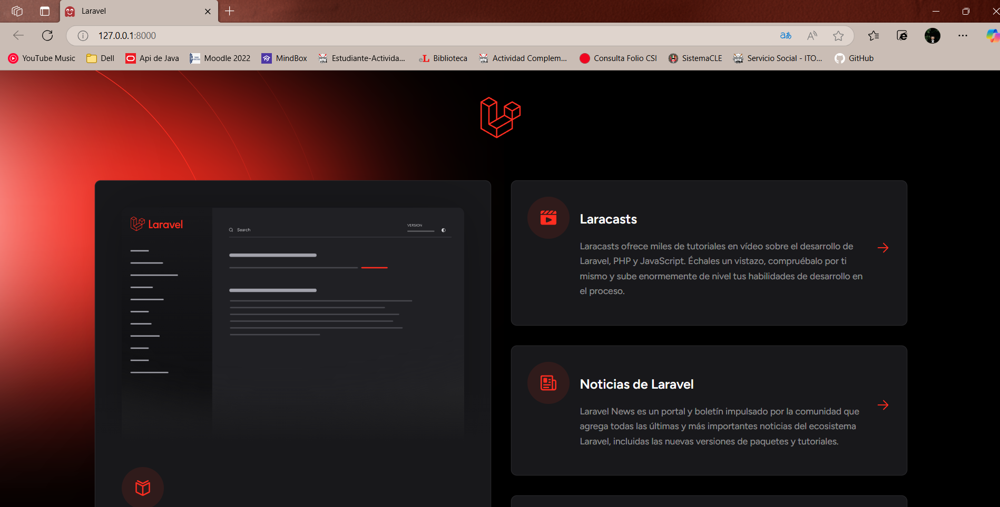
*******************************************************************************************************************************************

Parte 2:
Vamos a crear un archivo desde la carpeta "routes", que se llamara "api.php", donde estara las urls para cada componente, para que se obtenga los datos que se estara creando desde "Postman", por lo que al final debe de quedar asi: 
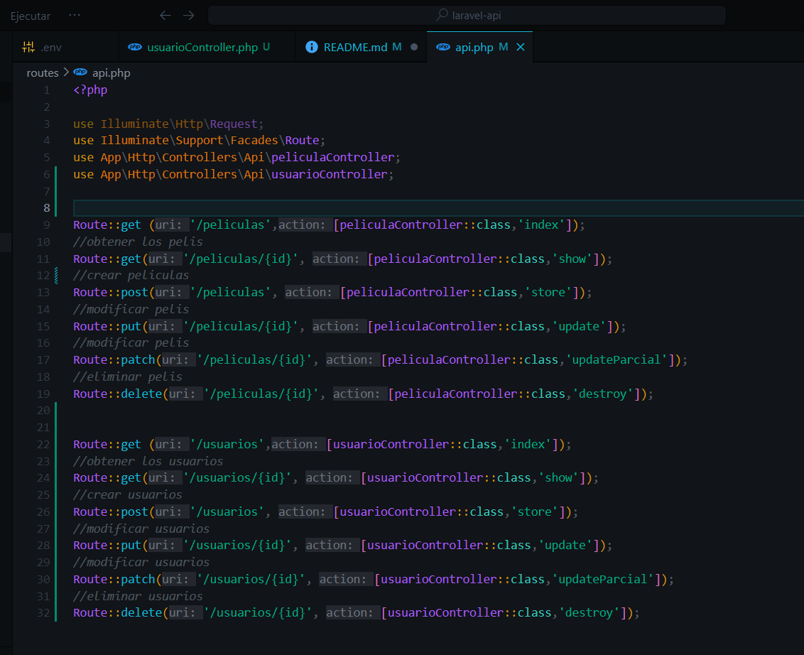

Una vez hecho eso, en el archivo ".env", se editara los siguientes datos, que se pondra el nombre de la base de datos, para que se vaya guardando la informacion de cada tabla que sera una API, en este caso, la base se llama "api_peliculas", el usuario sera "root", con mi respectiva contraseña para ingresar a mi base de datos. 
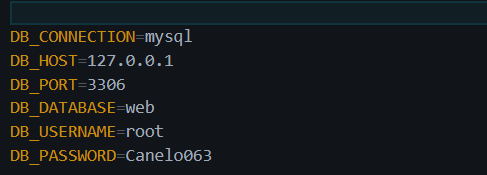
Ahora hacemos la migracion mediante la terminal de laravel, con el comando "Php artisan migrate", por lo que se debera migrar todos sus componentes, y al finalizar debe quedar asi dentro de la base desde MySql. 
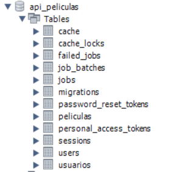

Ahora desde la carpeta "database", en la subcarpeta "migrations", tendra una archivo, donde se pondra todos las caracteristicas que debe de contener la tabla de peliculas, en este caso de la API peliculas. Esto se hace mediante el comando "php artisan make:migration create_peliculas_table", por lo que se creara y debera de contener lo siguiente:
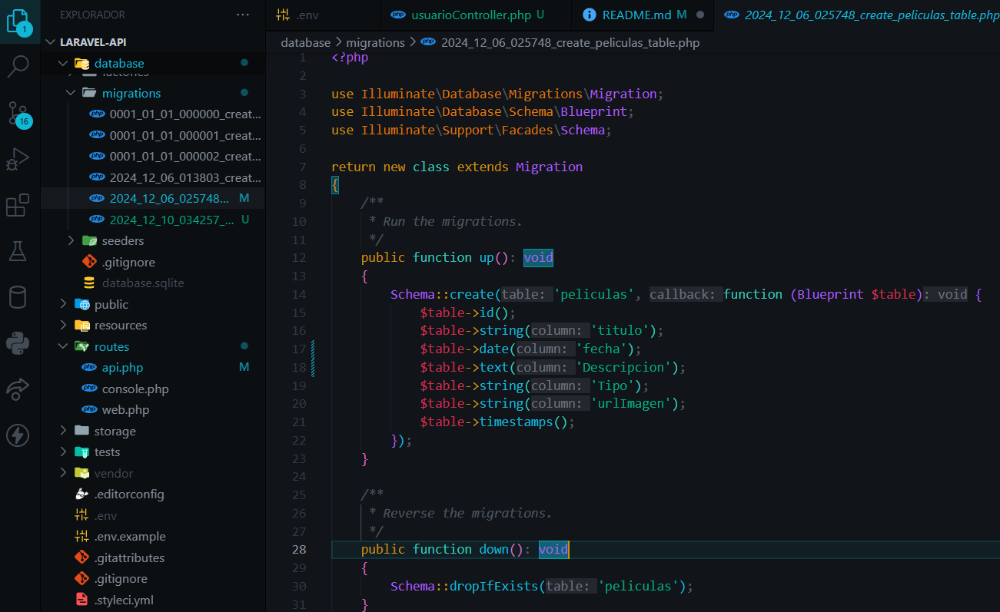

De igual forma se hace lo mismo para la tabla "Usuarios", que mediante el comando php artisan make:migration create_usuarios_table, se crea el archivo y debe de contener lo siguiente:
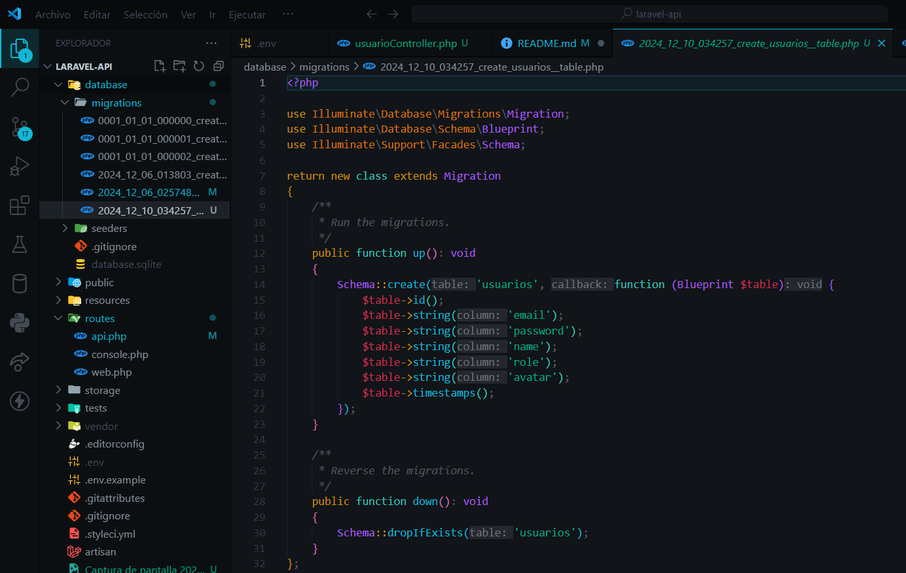.

Despues de haber acompletado dichos archivos con sus respectivos componentes, en la terminal, se ejecuta el comando "php artisan migrate", para que se migre a la base de datos, por lo que ya debera de aparecer asi en MySql, tanto para Usuarios como Peliculas:
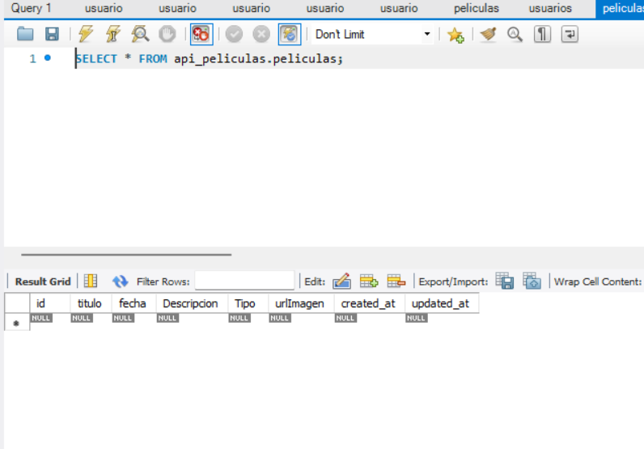
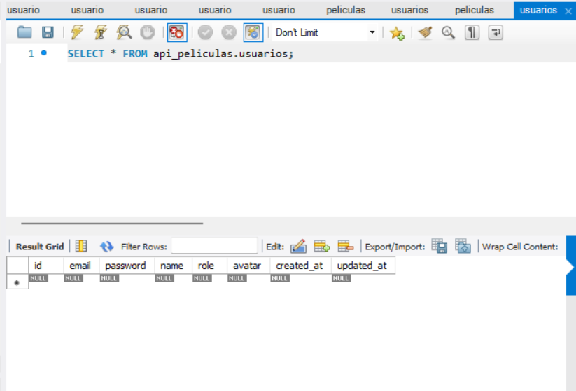
*******************************************************************************************************************************************

Parte 3: 
Ahora, en la carpeta "Http\Controllers", con el comando "php artisan make:controller Api/peliculaController", se creara un archivo y ahi mismo debe de contener toda la estructura para el funcionamiento de la API pelicula, ya que desde ahi, se estara creando, modificando, eliminando, y se visualizara toda informacion de peliculas que se vayan haciendo, este es el codigo: 
<?php

namespace App\Http\Controllers\Api;

use App\Http\Controllers\Controller;
use Illuminate\Http\Request;
use App\Models\Pelicula;
use Illuminate\Support\Facades\Validator;

class peliculaController extends Controller
{
    public function index(){
        $peliculas = Pelicula::all();
        if ($peliculas->isEmpty()){
            return response()->json(['mensaje'=>'No hay peliculas registrados']
            ,404);

        }
        return response()->json($peliculas,200);
    }
    public function store(Request $requerimiento){
        $validar=Validator::make($requerimiento->all(),[
            'titulo'=>'required',
            'fecha'=>'required|date',
            'Descripcion'=>'required',
            'Tipo'=>'required',
            'urlImagen'=>'required|url'
        ]);
        if($validar->fails()){
            $data=[
                'mensaje'=>'Erros de validacion de datos',
                'error'=>$validar->errors(),
                'status'=>400
            ];
            return response()->json($data,400);
        }
        $pelicula=Pelicula::create([
            'titulo'=>$requerimiento->input('titulo'),
            'fecha'=>$requerimiento->input('fecha'),
            'Descripcion'=>$requerimiento->input('Descripcion'),
            'Tipo'=>$requerimiento->input('Tipo'),
            'urlImagen'=>$requerimiento->input('urlImagen')
        ]);
        if(!$pelicula){
            $data=[
                'mensaje'=>'Erros de crear pelicula',
                'status'=>500
            ];
            return response()->json($data,500);
        }
        $data=[
            'pelicula' => $pelicula,
            'status' =>201
        ];
        return response()->json($data,201);
    }
    public function show($id){
        $pelicula=Pelicula::find($id);
        if(!$pelicula){
            $data=[
                'mensaje'=>'Pelicula no encontrada',
                'status'=>404
            ];
            return response()->json($data,404);
        }
        $data=[
            'pelicula'=>$pelicula,
            'status'=>200
        ];
        return response()->json($data,200);

    }
    public function destroy($id){
        $pelicula=Pelicula::find($id);
        if(!$pelicula){
            $data=[
                'mensaje'=>'Pelicula no encontrada',
                'status'=>404
            ];
            return response()->json($data,404);
        }
        $pelicula->delete();
        $data=[
            'mensaje'=>'Pelicula eliminada',
            'status'=>200
        ];
        return response()->json($data,200);

    }
    public function update(Request $requerimiento,$id){
        $pelicula=Pelicula::find($id);
        if(!$pelicula){
            $data=[
                'mensaje'=>'Pelicula no encontrada',
                'status'=>404
            ];
            return response()->json($data,404);
        }
        $validar=Validator::make($requerimiento->all(),[
            'titulo'=>'required',
            'fecha'=>'required|date',
            'Descripcion'=>'required',
            'Tipo'=>'required',
            'urlImagen'=>'required|url'
        ]);
        if($validar->fails()){
            $data=[
                'mensaje'=>'Erros de validacion de datos',
                'error'=>$validar->errors(),
                'status'=>400
            ];
            return response()->json($data,400);
        }
        $pelicula->titulo = $requerimiento->titulo;
        $pelicula->fecha = $requerimiento->fecha;
        $pelicula->Descripcion = $requerimiento->Descripcion;
        $pelicula->Tipo = $requerimiento->Tipo;
        $pelicula->urlImagen = $requerimiento->urlImagen;
        $pelicula->save();
        $data=[
            'mensaje'=>'Pelicula actualizada',
            'pelicula'=>$pelicula,
            'status'=>200
        ];
        return response()->json($data,200);
       
    }
    public function updateParcial(Request $requerimiento, $id)
    {
        $pelicula = Pelicula::find($id);
        if (!$pelicula) {
            $data = [
                'mensaje' => 'Pelicula no encontrada',
                'status' => 404
            ];
            return response()->json($data, 404);
        }
        if ($requerimiento->has('titulo')) {
            $pelicula->titulo = $requerimiento->input('titulo');
        }
        if ($requerimiento->has('fecha')) {
            $pelicula->fecha = $requerimiento->input('fecha');
        }
        if ($requerimiento->has('Descripcion')) {
            $pelicula->Descripcion = $requerimiento->input('Descripcion');
        }
        if ($requerimiento->has('Tipo')) {
            $pelicula->Tipo = $requerimiento->input('Tipo');
        }
        if ($requerimiento->has('urlImagen')) {
            $pelicula->urlImagen = $requerimiento->input('urlImagen');
        }
        $pelicula->save();
        $data = [
            'mensaje' => 'Pelicula actualizada parcialmente',
            'pelicula' => $pelicula,
            'status' => 200
        ];
        return response()->json($data, 200);
    }
}

De igual forma asi se hizo para "Usuarios", solo que con distinta estructura, ya que se crea con el comando "php artisan make:controller Api/usuariosController", una vez creado debe de contener de crear, modificar, visualizar y eliminar: 

<?php

namespace App\Http\Controllers\Api;

use App\Http\Controllers\Controller;
use Illuminate\Http\Request;
use App\Models\Usuario;
use Illuminate\Support\Facades\Validator;

class usuarioController extends Controller
{
    public function index()
    {
        $usuarios = Usuario::all();
        if ($usuarios->isEmpty()) {
            return response()->json(['mensaje' => 'No hay usuarios registrados'], 404);
        }
        return response()->json($usuarios, 200);
    }

    public function store(Request $requerimiento)
    {
        $validar = Validator::make($requerimiento->all(), [
            'email' => 'required|email|unique:usuarios',
            'password' => 'required|min:8',
            'name' => 'required|string|max:255',
            'role' => 'required|string',
            'avatar' => 'nullable|url'
        ]);

        if ($validar->fails()) {
            $data = [
                'mensaje' => 'Errores de validación de datos',
                'error' => $validar->errors(),
                'status' => 400
            ];
            return response()->json($data, 400);
        }

        $usuario = Usuario::create([
            'email' => $requerimiento->input('email'),
            'password' => bcrypt($requerimiento->input('password')),
            'name' => $requerimiento->input('name'),
            'role' => $requerimiento->input('role'),
            'avatar' => $requerimiento->input('avatar')
        ]);

        $data = [
            'usuario' => $usuario,
            'status' => 201
        ];
        return response()->json($data, 201);
    }

    public function show($id)
    {
        $usuario = Usuario::find($id);
        if (!$usuario) {
            return response()->json(['mensaje' => 'Usuario no encontrado'], 404);
        }
        return response()->json($usuario, 200);
    }

    public function update(Request $requerimiento, $id)
    {
        $usuario = Usuario::find($id);
        if (!$usuario) {
            return response()->json(['mensaje' => 'Usuario no encontrado'], 404);
        }

        $validar = Validator::make($requerimiento->all(), [
            'email' => 'nullable|email|unique:usuarios,email,' . $id,
            'password' => 'nullable|min:8',
            'name' => 'nullable|string|max:255',
            'role' => 'nullable|string',
            'avatar' => 'nullable|url'
        ]);

        if ($validar->fails()) {
            $data = [
                'mensaje' => 'Errores de validación de datos',
                'error' => $validar->errors(),
                'status' => 400
            ];
            return response()->json($data, 400);
        }

        $usuario->update(array_filter($requerimiento->all(), fn($value) => $value !== null));

        return response()->json(['mensaje' => 'Usuario actualizado', 'usuario' => $usuario], 200);
    }

    public function updateParcial(Request $requerimiento, $id)
    {
        return $this->update($requerimiento, $id);
    }

    public function destroy($id)
    {
        $usuario = Usuario::find($id);
        if (!$usuario) {
            return response()->json(['mensaje' => 'Usuario no encontrado'], 404);
        }

        $usuario->delete();

        return response()->json(['mensaje' => 'Usuario eliminado'], 200);
    }
}
******************************************************************************************************************************************

Parte 4:
En la carpeta Models, solo se implementa los campos que debe de contener cada tabla, en este caso la API, esto se hace con el comando "php artisan make:model Pelicula", y debe de contener lo siguiente: 
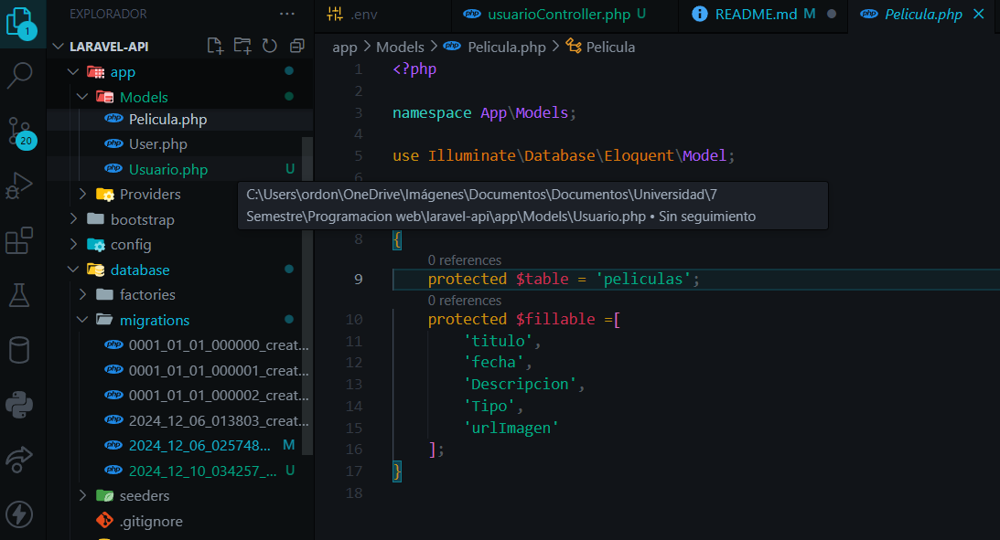

Y de igual forma asi se crea para "Usuario", mediante el siguiente comando "php artisan make:model Usuario", con lo que debe de contener lo siguiente: 

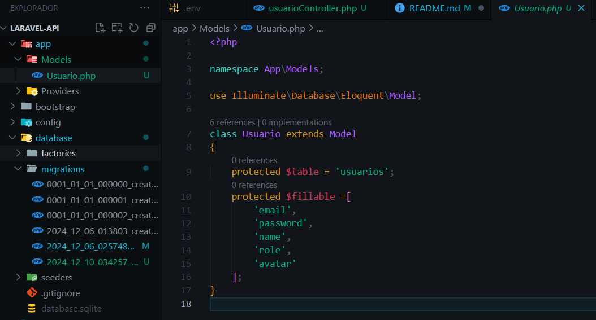

*****************************************************************************************************************************************
Ahora abriendo la aplicacion de postman, se pone el url "http://127.0.0.1:8000/api/peliculas", ahora se le pone la opcion de "post", para agregar una nueva pelicula. Por lo mientras no se tiene nada registrado como se muestra a continuacion: 

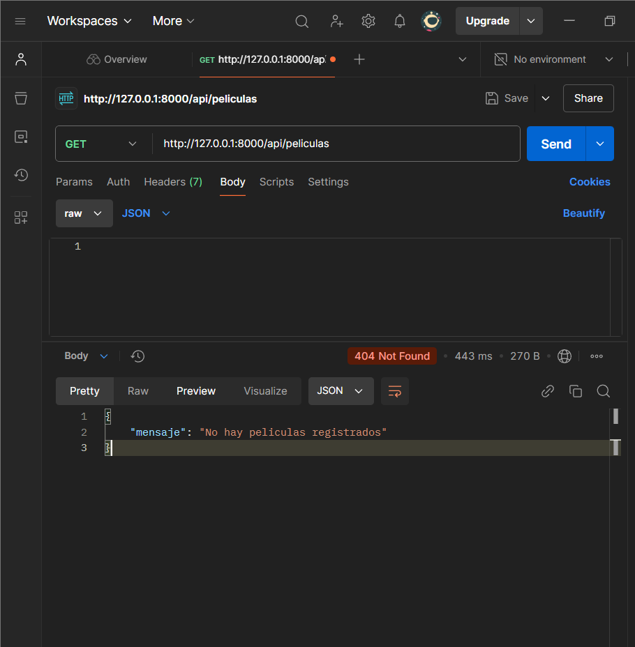

Pero cuando creamos una nueva pelicula, ponemos los datos en base a los atributos de la tabla que se creo, con la opcion de post, y en automatico, se nos mostrara, asi como a continuacion:
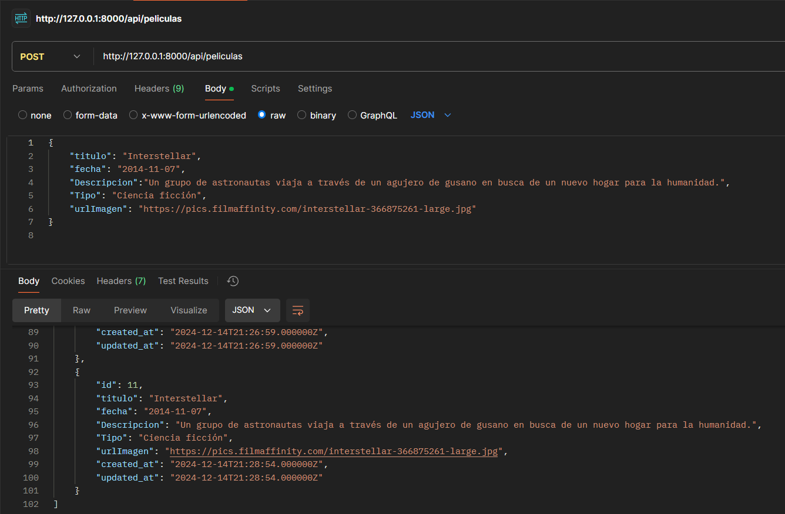
Y en el navegador se vera asi, en este caso ya se tiene los registros necesarios 
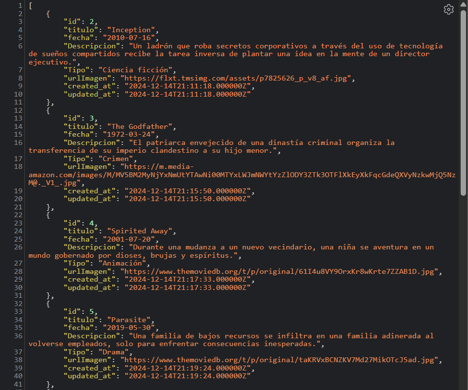

Para los usuarios es lo mismo, desde postman ponemos la url, de "http://127.0.0.1:8000/api/usuarios", por el momento no se tiene registrado nada, por lo que se nos muestra ese mensaje en consola.
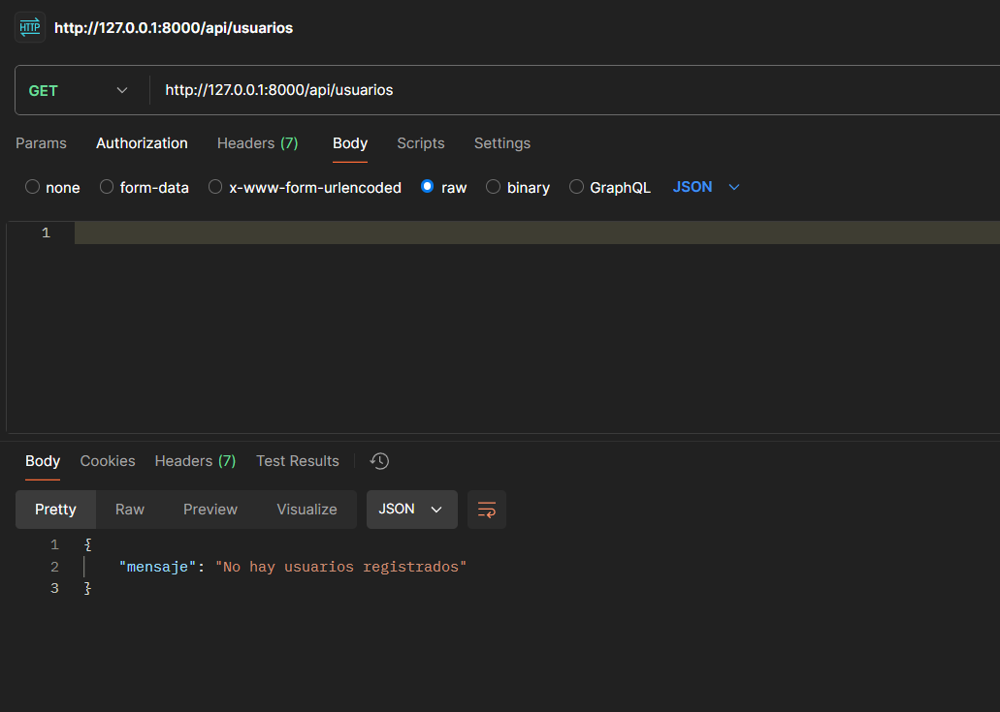

Para ingresar los datos se hace de la siguiente forma, solo que con el tipo que sea "Post", para asi crear el primer registro de la API usuarios
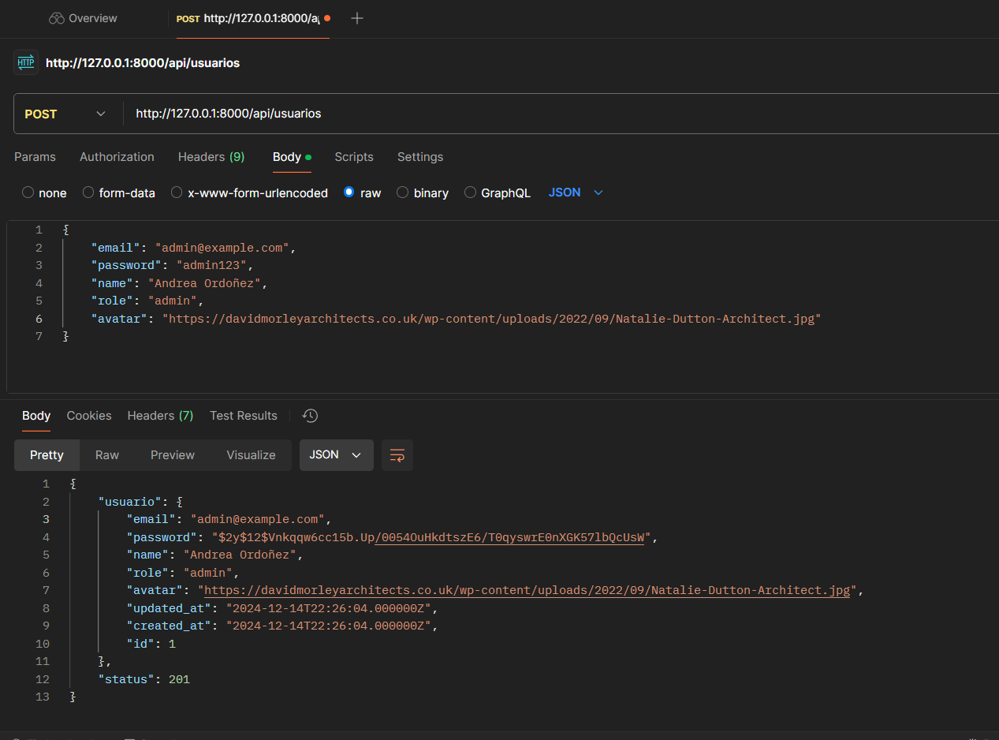

Una vez ya registrados todos los usuarios necesarios, mediante el get en postman se podran visualizar o en el mismo navegador con la url de usuarios, algo asi se mostrara: 

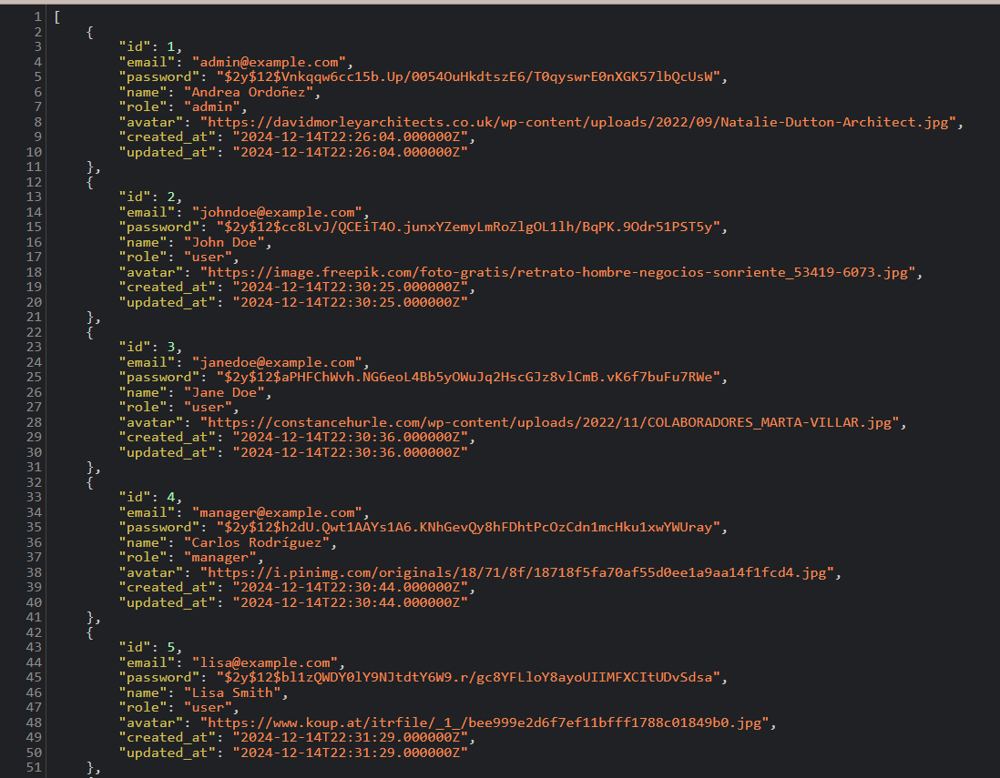